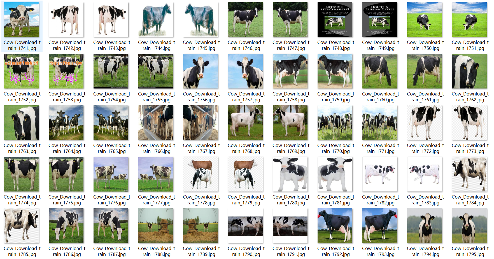
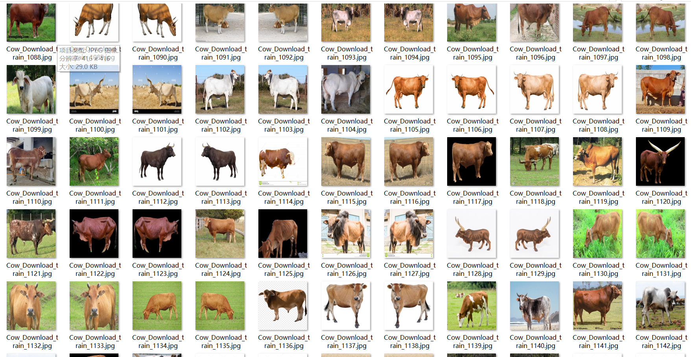
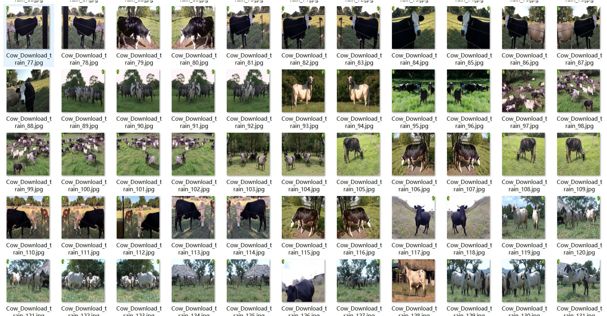

# [Animal Dataset] Cattle Target Detection Dataset VOC+YOLO format4016 images1-class

Dataset Description: ~

Dataset format: Pascal VOC format + YOLO format (the txt file does not contain the split path, it only contains jpg images and corresponding VOC format xml files and yolo format txt files)

Number of images (number of jpg files): 4016

Number of annotations (number of xml files): 4016

Number of annotations (number of txt files): 4016

Number of categories: 1

Annotation class names: ["Cow"]

Number of boxes labeled in each category:

Cow frame count = 7948

Total boxes: 7948

Use the labeling tool: labelImg

## Images

---

Here is a pay link on Stripe (https://buy.stripe.com/3cs8yP7sY87d0vu9AB). Please contact me lonlonago@foxmail.com after funding $89, and I will send you a complete data files, thank you!

